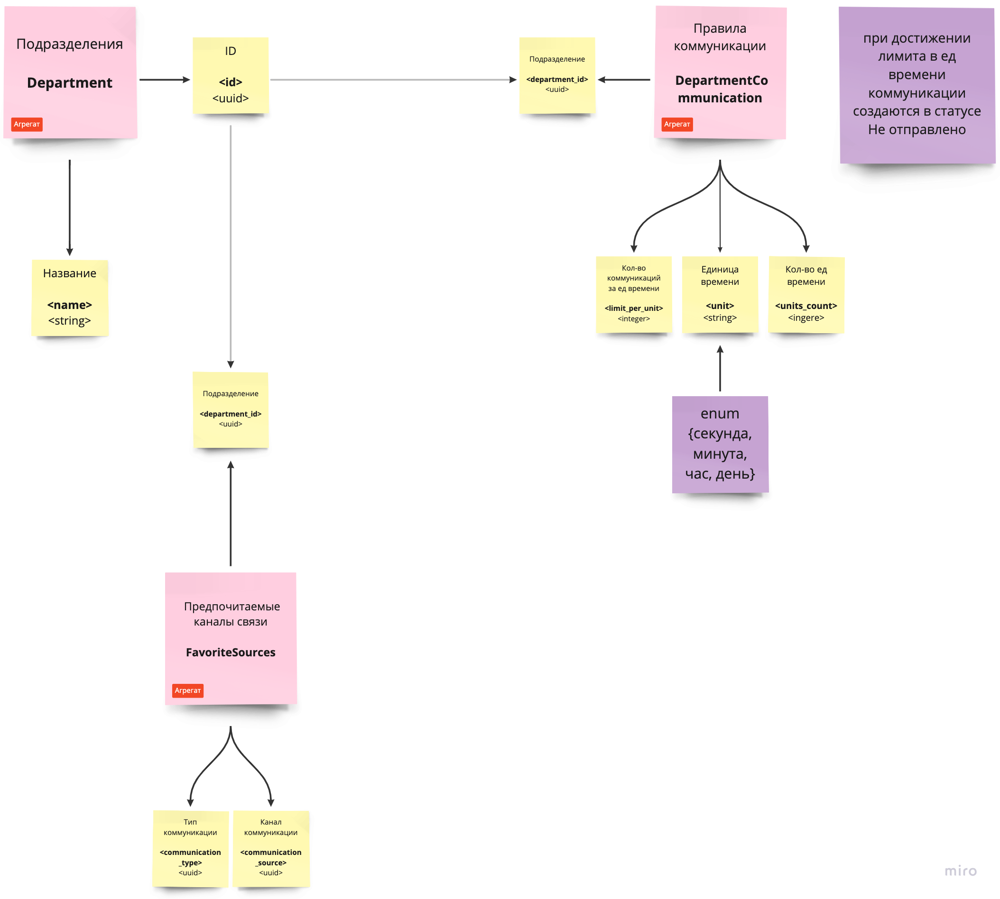

# Карта контекста

## Коммуникация

Сущность `Коммуникация <Communication>` является агрегатом. Это одна из основных сущностей, в которой хранятся все акты коммуникаций. 

Через агрегат `Коммуникация` реализуется единая точка по отправке коммуникаций, в ней хранятся все сообщения, в том числе не доставленные. 
Примерная логика создания коммуникации:
- Создается запись в таблице в статусе `Не отправлено`
- Ставится фоновая задача на отправку сообщения
- В результате отработки задачи проверяются все политики для пользователя и департамента, проверяются способы отправки сообщения, сообщение ставится в очередь на отправку
- Если сообщение были успешно отправлено, статус коммуникации переводится в `Отправлено`

> Всвязи с малым контекстом задачи и условия реализации> 
(это тестовое задание) добавлен минимальный набор статусов для коммуникации: `Не отправлено`, `Отправлено`, `Забронировано`

| Описание | Название      | Тип | Правило |
| -------- | -------- | -------- | -------- |
| ID | `<id>`   | `<uuid>` | |
| Подразделение | `<department_id>`   | `<uuid>` | |
| Пользователь | `<user_id>`   | `<uuid>` | |
| Тип коммуникации| `<communication_type_id>`   | `<uuid>` | |
| Канал коммуникации| `<communication_source_id>`   | `<uuid>` | |
| Дата отправки сообщения| `<communication_date>`   | `<datetime>` | |
| Статус коммуникации| `<status>`   | `<string>` | enum{Не отправлено, Отправлено, Забронировано} |
| Сообщение | `<message>`   | `<text>` | | 

Команды, предусмотренные в рамках текущего задания:
- Отправка коммуникации;
  Логика отправки коммуникации описан выше
- Бронирование клиентов для коммуникации в будущем;
  Мы поняли этот пункт буквально - создание коммуникации в будущем
- Обновление статуса отправленной коммуникации;
  Тут не совсем понятно, какие возможны коммуникации у отправленной коммуникации

## Пользователь и Доступность для коммуникации

Сущность `Пользователь <User>` хранит всех клиентов компании, с которыми когда-либо велась коммуникация. Для сущности задан набор команд, реализующих крудовые операции

| Описание | Название      | Тип | Правило |
| -------- | -------- | -------- | -------- |
| ID | `<id>`   | `<uuid>` | |
| Имя | `<first_name>`   | `<string>` | |
| Фамилия | `<last_name>`   | `<string>` | |
| Телефон | `<phone>`   | `<string>` | |
| Email | `<email>`   | `<string>` | |

> Статусная модель тут не добавлена, поскольку было предположено, что пользователи агрегируются автоматически из других систем/ресурсов

В сущность `Доступность для коммуникации <UserCommunications>` вынесены настройки, определяющие доступность клиента для коммуникации

| Описание | Название      | Тип | Правило |
| -------- | -------- | -------- | -------- |
| Пользователь | `<user_id>`   | `<uuid>` | |
| Старт блокировки | `<blocked_from>`   | `<datetime>` | |
| Окончание блокировки | `<blocked_to>`   | `<datetime>` | |
| Статус доступности для коммуникации | `<status>`   | `<string>` | enum {active, blocked} |

##  Тип коммуникации

Сущность `Тип коммуникации <CommunicationType>` является справочником. Дефолтные значения из постановки задачи: `Массовая коммуникация`, `Персональная коммуникация`, `Информационная`, `Опрос`, `Коммерческий опрос`, `Сервисная коммуникация`
Предусмотрен набор команд, определяющих крудовые операции

> Статусная модель в рамках тестового
> задания упрощена до двух основных статусов 
> `active`, `blocked`

| Описание | Название      | Тип | Правило |
| -------- | -------- | -------- | -------- |
| ID | `<id>`   | `<uuid>` | |
| Название | `<name>`   | `<string>` | |
| Статус   | `<status>` | `<string>` | enum {active, blocked} |

##  Канал коммуникации

Сущность `Канал коммуникации <CommunicationSource>` является справочником. Дефолтные значения из постановки задачи: `SMS`, `Messenger`, `Электронная почта`, `Push`
Предусмотрен набор команд, определяющих крудовые операции

> Статусная модель в рамках тестового
> задания упрощена до двух основных статусов 
> `active`, `blocked`

| Описание | Название      | Тип | Правило |
| -------- | -------- | -------- | -------- |
| ID | `<id>`   | `<uuid>` | |
| Название | `<name>`   | `<string>` | |
| Статус   | `<status>` | `<string>` | enum {active, blocked} |

## Дапартамент

Сущность `Департамент <Department>` является агрегатом.  Эта сущность введена из анализа требований для прототипа
Для департаментов задаются политики для коммуникаций.

| Описание | Название      | Тип | Правило |
| -------- | -------- | -------- | -------- |
| ID | `<id>`   | `<uuid>` | |
| Название | `<name>`   | `<string>` | |

Сущность `Предпочитаемые каналы связи <FavoriteSources>` является агрегатом, реализует настройку, позволяющую задавать предпочитаемые каналы связи для разных департаментов. Реализует `many_to_many` связь

| Описание | Название      | Тип | Правило |
| -------- | -------- | -------- | -------- |
| Подразделение | `<id>`   | `<uuid>` | |
| Тип коммуникации | `<communication_type_id>`   | `<uuid>` | |
| Канал коммуникации| `<communication_source_id>`   | `<uuid>` | |

Сущность `Правила коммуникации <DepartmentCommunication>` является агрегатом, реализует настройку, позволяющую задавать лимиты в единицу времени для пользователя

| Описание | Название      | Тип | Правило |
| -------- | -------- | -------- | -------- |
| ID | `<id>`   | `<uuid>` | |
| Подразделение | `<id>`   | `<uuid>` | |
| Кол-во коммуникаций за ед времени | `<limit_per_unit>`   | `<integer>` | |
| Единица времени| `<unit>`   | `<string>` | enum {секунда, минута, час, день} |
| Кол-во ед времени | `<units_count>`   | `<integer>` | |

## Клиенты АПИ

По логике постановки задачи необходимо реализовать 2 вида апи и соответсвенно 2 вида аутентификации

- `admin api` для frontend клиента, для интеграции с backend и работы менеджеров системы омниканальности в веб интерфейсе. Тут должга быть реализована базовая аутентификация, когда на основе пары логин/пароль выдаются `access token` и `refresh token`
- `public api` специальный апи, позволяющий внешним системам получать доступ к данным системы: другие микросервисы, любые другие внешние системы. Тут должна быть реализована аутентификация на основе пары `api_key` и `secret_api_key`

> Опять же, в рамках тестового задания мы ограничились одним видом аутентификации на основе пары логин/пароль, используя встроенный возможность django.